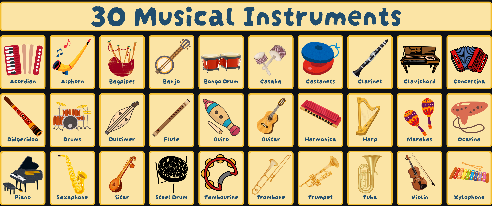

# 30 Musical Instrument

## Overview Project
Proyek ini bertujuan untuk mengembangkan sistem klasifikasi citra untuk pengenalan dan identifikasi instrumen musik secara otomatis dengan memanfaatkan model deep learning ResNet50 dan VGG16. Sistem ini dirancang untuk menganalisis gambar instrumen musik dan mengklasifikasikannya ke dalam kategori yang sesuai. Dengan teknologi ini, diharapkan dapat meningkatkan efisiensi dan akurasi dalam proses identifikasi instrumen musik, yang dapat diaplikasikan pada berbagai bidang seperti pendidikan musik, manajemen data multimedia, hingga aplikasi pengarsipan budaya. Pemanfaatan arsitektur ResNet50 dan VGG16 memberikan keuntungan dalam mengolah fitur visual kompleks dari gambar, memastikan performa model yang andal dan skalabilitas yang tinggi. Proyek ini juga menjadi langkah awal dalam mengintegrasikan teknologi modern ke dalam pengenalan instrumen musik secara otomatis.

## Dataset
Dataset yang digunakan berasal dari Kaggle dengan nama "Musical Instruments Image Classification" dan dapat diakses melalui tautan berikut: [Musical Instruments Image Classification](https://www.kaggle.com/datasets/gpiosenka/musical-instruments-image-classification). Dataset ini mencakup berbagai citra instrumen musik seperti gitar, piano, drum, dan lain-lain yang telah diklasifikasikan ke dalam beberapa kategori.

## Deskripsi Model
Proyek ini menggunakan dua model utama untuk klasifikasi citra:
1. **ResNet50**: Model ini dikenal dengan arsitekturnya yang mendalam menggunakan residual connections, yang membantu mengatasi masalah vanishing gradient dan memungkinkan pelatihan model dengan banyak lapisan.
2. **VGG16**: Model ini memiliki arsitektur yang sederhana namun efektif dengan layer-layer konvolusi yang disusun secara berurutan, ideal untuk pengenalan pola visual.

Kinerja model dievaluasi menggunakan metrik akurasi, precision, recall, dan F1-score. Kedua model dioptimasi menggunakan dataset yang telah disiapkan dan dibandingkan performanya untuk menentukan model terbaik.

## Hasil dan Analisis
Hasil evaluasi menunjukkan perbandingan performa antara ResNet50 dan VGG16 dalam mengklasifikasikan citra instrumen musik. Berikut adalah hasil metrik evaluasi:

| Model    | Akurasi | Precision | Recall | F1-Score |
|----------|---------|-----------|--------|----------|
| ResNet50 | 99%     | 99%       | 99%    | 99%    |
| VGG16    | 96%     | 97%       | 96%    | 96%    |

Grafik perbandingan performa dapat dilihat pada aplikasi web yang telah disediakan. Berdasarkan analisis, ResNet50 menunjukkan hasil yang lebih baik dibandingkan VGG16 dalam pengklasifikasian dataset ini.

## Author
M. Rio Gunawan (202110370311026)
